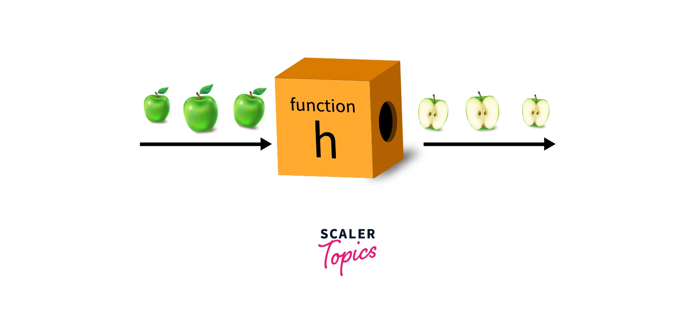

# Functions




# What are they?

A block of code that is written for some specific purpose.

A function essentially receives some raw input (parameters), do some processing, and returns an output.

They are used to subdivide your program code into logical components.


# Functions in Clarity

Majorly we have two types of functions in clarity


    - Built-in Functions

    - User-defined functions

    

## Built-in Functions 

The functions that come bundled with the programming language itself. The user does not have to write the logic of these functions.

i.e `add` and `subtract` represented by `+` and `-` respectively are used to perform addition and subtraction on two numbers. 


### Built-in functions in clarity

Clarity has a blessed set of built-in functions for example

`print` ,`print-twice` , arithmetic functions like + , - , mod , /  and * and a lot more.


for more details on various built-in functions, refer to 


## User-defined Functions 

The functions that are written by the programmer and do not come predefined with the language are called user-defined functions.

User-defined functions leverage the built-in functions means they are built on top of built-in functions.


i.e Following function


```clarity

(define-public (PrintHello)

    (print "Hello")

)

```


Uses the built-in function `print` to print a custom message to the user.


## Another Example


```clarity

(define-public (GreetMe (UserName string-ascii-8 ))

    (print "Hello,")

    (print UserName )

    

)

```

The above function receives a parameter `username` of type string ( we represent string data type with `string-ascii-8` in clarity)

and prints hello first and then the passed username.


# function declaration 


Telling the language about the definition of what the function does is an important part of programming.

In clarity, you can declare a function as follows


```clarity

( function-visibility  ( function-name (param1-name param1-type) (param2-name param2-type).. (paramN-name paramN-type) ) function-body)

```


# Functions Invocation

So you have written some functions for a particular purpose by learning from this repository, but how to use them?


Using a function can be referred to as `Calling a function or `invoking a function


In Clarity, function invocation is done by the following method


(function-name paramter1 paramter2 ... paramterN)


( a function can have as many parameters as it needed but try to use less of them )


so let's function by an example


### Examples - Built-in


```clarity

(print "hello")  

  

  ```

will print hello on the screen.

```clarity

(+ 6 7 )  

  

  ```


will return 13 because this function adds 6 and 7


```clarity

(define-public (GreetMe (UserName string-ascii-8 ))

    (print "Hello,")

    (print UserName )

    

)


(GreetMe "Umar")


```


This function will output `Hello, Umar`


## Functions Visibility

So you saw the `define-public` keyword in the function definition. what is that?

Do not worry, we got you covered.

Function visibility means `who has access to this function


Following are three function visibilities available in clarity

    

    - Public

    - Private

    - Read-only

    

### Public functions 

These are the ones that can be called by anyone in the smart contract or a user account on the stacks blockchain. 

They do not have restrictions on the caller of the function. 

They are declared with the `define-public` keyword.


### Private functions 

Private functions are defined in the same manner as public functions.

The difference is that they can only be called by the current contract. 

They cannot be called from other smart contracts, nor can they be called directly by sending a transaction. 

They are declared with the `define-private` keyword.


### Read-only functions

Read-only functions can be called by the contract itself, as well as from the outside. They can return any type, just like private functions.


As the name implies, read-only functions may only perform read operations.

You can read from data variables and maps but you cannot write to them.

They are declared with the `define-read-only` keyword.


### For more details on functions

Check the official documentation of clarity on Functions [Here](https://book.clarity-lang.org/ch05-00-functions.html)


# Ending Note 

So this was all about the basics of functions in clarity.

We are all set. 

And Let's keep going! 


Meanwhile, give a tap on your back because you are doing great work ✨ 


Time to get hands with a most powerful thing in clarity called Mappings. Let's conquer the [Mappings](./Mappings.md)


